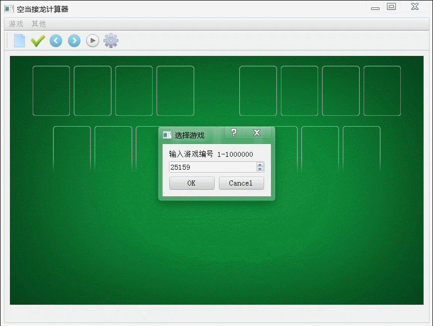

# FreeCellCalculator
空当接龙计算器

-

自动求解空当接龙游戏，游戏编号与Windows自带游戏一致，只能在Windows中运行。

使用改编过的多线程A*算法，求解速度相比原来提升一倍以上。

软件提供了中/英两种语言，可以自动判断系统设置选择合适的语言。

编译需要Qt5，测试环境：Windows7 + VS2015 + Qt5.6.1

-

FreeCellCalculator can provide solution for the Windows game 'FreeCell', the game number is same as the original game, for Windows only.

By using the multithreaded A* algorithm, it speeds up more than 100%.

The software provides Chinese and English, and it can also choose proper language by system config automatically.

You need Qt5 to compile it, my environment : Windows7 + VS2015 + Qt5.6.1

-

